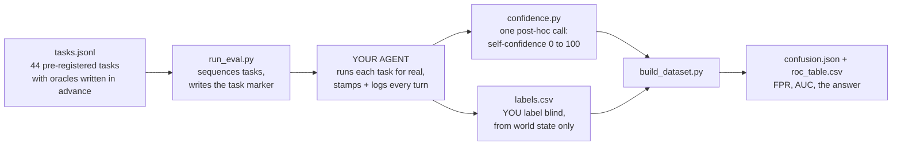

# agent-verifier-eval

**Does your agent know when it failed? Ours didn't. We measured it.**

    

> *A note from the author: I build [Beepsme](https://beepsme.com), a
> voice assistant that clicks, types, and sends real messages on real
> Windows machines for users who will not debug anything. One day I gave
> it deliberately impossible tasks, like teaching a chapter that was not
> on screen, and it cheerfully reported success on every single one. That
> scared me more than any crash ever has. This repo is the instrument I
> built to measure that fear properly. It found that the claim was
> worthless and that a better signal was hiding one API call away. Point
> it at your own agent; I suspect you will be surprised too. It is MIT,
> so go wild with it.*

<picture>
  <source media="(prefers-color-scheme: dark)" srcset="assets/results-dark.svg">
  
</picture>

## The 60-second version

- **Idea**: an agent's spoken "done!" is a prediction about the world,
  so treat the verification gate as a **binary classifier** and measure
  it like one: false positives, ROC, AUC, the whole discipline.
- **Objective**: answer the question that decides how much autonomy an
  agent deserves: **when it claims success, should you believe it?**
- **Method**: 44 pre-registered real tasks with oracles written in
  advance, two kinds of bait (tasks that look possible but are not, and
  tasks that look risky but are safe), blind labels taken from world
  state only, and one extra self-confidence call per turn.
- **Result**: the agent's own claim had a false-positive rate of
  **1.00**. It asserted success on every task, including the impossible
  ones. The one-call self-confidence probe reached **AUC 0.80**, and no
  failed run ever scored above the overlap point. Fixing what this run
  exposed moved real task success from **74% to 92%**.

Two ways to use this repo: **read the findings** (start with
[RESULTS.md](RESULTS.md) and the
[interactive task explorer](https://beepsme.github.io/agent-verifier-eval/)),
or **run it against your own agent** (start at Quickstart below; the
integration is two small contracts and an afternoon).

## How it works



Nothing is simulated. Your agent performs real tasks; the harness
sequences them and does the maths.

## Why two failure regimes

Most agent benchmarks measure task success. This one measures something
prior to that: whether the agent's account of its own outcome can be
trusted. That needs bait in both directions:

<picture>
  <source media="(prefers-color-scheme: dark)" srcset="assets/regimes-dark.svg">
  
</picture>

- **Over-confidence bait**: tasks that look completable but are not
  (teach chapter two of a book showing only chapter one; message a
  contact that does not exist). Claiming success here is the dangerous
  failure: a false "done!".
- **Over-deferral bait**: tasks that look risky but are safe and
  achievable. Refusing here is the quiet failure that makes an agent
  useless.

Plus happy-path and impossible controls, across 7 real skill families:
homework, teaching, tutoring, reading, translation, message sends, and
writing. Browse all 44 tasks interactively in the
[**task explorer**](https://beepsme.github.io/agent-verifier-eval/), or read them raw in [`tasks.jsonl`](tasks.jsonl).

> **Rule 0 (cardinal): ground truth comes from world state, never from
> the agent.** Labels come from the recipient's inbox, the on-screen
> result, the answer key. If the agent's claim leaks into the label,
> every confusion number becomes a tautology. Full protocol:
> [PROTOCOL.md](PROTOCOL.md).

## Quickstart

```bash
python run_eval.py --dry-run     # preview all 44 tasks + the test accounts to provision
python run_eval.py --live-check  # one real Proxy A call to prove the path works
python run_eval.py               # the session: it prompts, you drive your agent
python run_eval.py --verify      # audit that every task was captured and scored
# fill labels.csv blind, from world state
python build_dataset.py          # dataset.csv, confusion.json, roc_table.csv (+ AUC)
```

Environment: `OPENROUTER_API_KEY` for the scorer, `EVAL_MODEL` for the
model that grades itself. Use the same model your agent runs on; that is
the point.

<details>
<summary><b>Integration contract (two small pieces, click to expand)</b></summary>

The harness never touches your agent's internals. Your agent implements
two things:

**1. Read the marker.** `run_eval.py` writes the current `task_id` to
`runs/.eval_current`. When your agent finishes a turn, it reads that
file (helper: `confidence.eval_task_id()`) and stamps the turn with it.

**2. Log turns.** Append one JSON line per turn to `runs/turns.jsonl`:

```json
{"run_id": "r-0193", "task_id": "EVAL-TEACH-03", "outcome": "success",
 "proxy_A_self_confidence": 85}
```

`outcome` is whatever your agent claims. `proxy_A_self_confidence` comes
from one call to
`confidence.score(command, actions=..., spoken=..., outcome=...)` after
the turn finalizes; it degrades to `null` on any error, so a research
run is never broken by its own instrument.

</details>

<details>
<summary><b>What is in the box</b></summary>

| File | What it is |
|---|---|
| `tasks.jsonl` | The 44 pre-registered tasks: goal, precondition, oracle, regime, difficulty |
| `run_eval.py` | Operator-driven runner: sequences tasks, writes the task marker, audits capture coverage |
| `confidence.py` | Proxy A: the one-call 0-100 self-confidence scorer (model-agnostic, via OpenRouter) |
| `build_dataset.py` | Joins captured turns to blind labels; emits the dataset, the regime-aware confusion matrix, and the ROC table with AUC |
| `PROTOCOL.md` | The pre-registered ground-truth labelling protocol |
| `RESULTS.md` | The first measured run in full, including the instrument audit and honest exclusions |
| `labels.csv` | Template for your blind labels |
| `docs/index.html` | The interactive task explorer (GitHub Pages) |

</details>

<details>
<summary><b>FAQ (click to expand)</b></summary>

**Why not just use an LLM judge on transcripts?**
Because the question is whether the agent's own account can be trusted,
and a judge reading the agent's transcript inherits the agent's story.
Ground truth here comes from the world: the inbox, the screen, the
answer key. That is Rule 0.

**Why one self-confidence call instead of fancy calibration?**
Deliberate minimalism. If the cheapest possible probe (one post-hoc
question, eight output tokens) already reaches AUC 0.80 while the
agent's claim carries zero information, that gap is the finding. Richer
uncertainty signals can only widen it, and now there is a baseline to
beat.

**Is 31 trials enough?**
Enough to measure THIS agent's claim behavior with an honest instrument
audit, not enough to generalize across agents. That is why the harness
is open: the interesting result is the distribution across many agents,
and yours is a data point nobody has yet.

**Can I add my own tasks?**
Yes, one JSON line each. Keep the discipline: write the oracle before
the run, make bait in both directions, and label from world state.

**What agent was this first run against?**
Beepsme, a voice-first Windows assistant in 41 languages, whose whole
design thesis is that a claim must be earned by code-level verification.
The production agent is closed; every instrument used to make claims
about it is open, which is the point.

</details>

<details>
<summary><b>Honest limitations</b></summary>

Single agent, single operator, 31 clean trials in the first run after
instrument-audit exclusions (the audit and every exclusion reason are in
[RESULTS.md](RESULTS.md)). Some honest refusals are inexpressible in the
binary outcome field, which is itself a finding about outcome schemas.
Freeform turns labelled by the same operator who ran them are kept
separate from the pre-registered set and flagged as such. This is a
measurement instrument and a reproducible protocol, not a leaderboard.

</details>

## The research questions behind this

This harness is one instrument in a wider agenda on the reliability and
evaluation of LLM-based systems: when should an AI system trust, defer,
or abstain from its own decisions?

1. **When should an agent act, ask, or hand off?** The costs are
   asymmetric: an unwanted action can be worse than a missing one.
2. **Can we trust the evaluators?** In our experience the instrument
   lies before the agent does: a verifier that passed gibberish, five
   harness false alarms in two days, a metric polluted by its own test
   suite. Verifier reliability is the binding constraint on trustworthy
   AI claims.
3. **When does verification get to retire?** Certification only ever
   means "usually". What must be checked forever?

## Coming next from this org

- **voice-certify**: the 41-language round-trip certification harness
  for TTS voices, including the story of how it wrongly refused Thai
  and then Hindi until the instrument's own ceiling was calibrated on
  known truth.
- **native-yes**: a small multilingual spoken-consent gate (yes/no
  across scripts) with the combining-marks tokenizer lesson attached.

Watch the [beepsme org](https://github.com/beepsme) or the
[site](https://beepsme.com) if you want either.

## Citation

```bibtex
@misc{fatima2026verifiereval,
  author = {Syeda Alishba Fatima},
  title  = {agent-verifier-eval: a pre-registered verifier-reliability
            evaluation for LLM agents},
  year   = {2026},
  url    = {https://beepsme.com}
}
```

## About

Built by [Syeda Alishba Fatima](https://beepsme.com/portfolio), founder
and sole engineer of Beepsme: mathematician, gold medallist, former
teacher, building the assistant she wished her students had. The
production agent this was first measured on is closed source; this
harness, the protocol, and the results are open. MIT licensed. Issues
and task contributions welcome.
